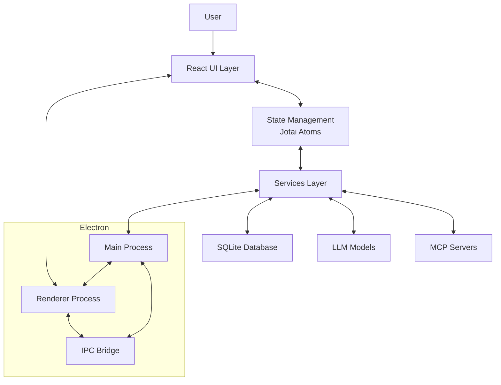
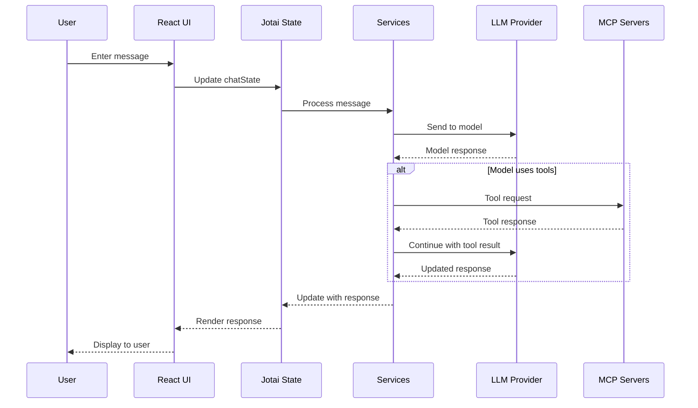

# System Patterns: Dive AI Agent

## Architecture Overview

Dive follows a modern Electron-based architecture with a clear separation of concerns:

## Key Design Patterns

### 1. Atomic State Management
Dive uses Jotai for state management, organizing state into atomic pieces that can be composed together. This pattern allows for:
- Fine-grained reactivity
- Reduced re-renders
- Simplified state sharing across components
- Better code organization by state domain

Key state atoms are organized in the `src/atoms/` directory, with separate files for different domains like chat, configuration, history, etc.

### 2. Service-Oriented Architecture
Backend functionality is organized into services that handle specific concerns:
- Database service for persistence
- Model services for LLM interactions
- MCP services for external tool integration
- Route services for API endpoints

This separation allows for better testability, maintainability, and the ability to evolve different parts of the system independently.

### 3. Protocol-Based Integration
The Model Context Protocol (MCP) is central to Dive's extensibility. It defines a standard way for:
- LLMs to request access to external tools and resources
- External services to expose capabilities to LLMs
- Standardizing the format of requests and responses

This protocol-based approach allows for pluggable components without tight coupling.

### 4. Electron Main/Renderer Pattern
Following Electron's architecture:
- Main process handles system-level operations, file access, and backend services
- Renderer process manages the UI and user interactions
- IPC (Inter-Process Communication) bridges the two securely

### 5. React Component Hierarchy
The UI follows a clear component hierarchy:
- Views: Full page components (`src/views/`)
- Components: Reusable UI elements (`src/components/`)
- Hooks: Shared behavior logic (`src/hooks/`)

## Data Flow

## Key Technical Decisions

### 1. Electron as Application Framework
- Provides cross-platform compatibility
- Allows for rich desktop integration
- Enables local processing and storage

### 2. React for UI
- Component-based architecture
- Strong ecosystem and community support
- Efficient rendering with virtual DOM

### 3. TypeScript for Type Safety
- Enhances code quality and maintainability
- Provides better developer experience with autocompletion
- Catches type-related errors at compile time

### 4. SQLite for Local Storage
- Lightweight yet powerful database
- No external dependencies or services required
- Efficient for the types of data stored (conversations, settings)

### 5. Vite for Build System
- Fast development server with hot module replacement
- Efficient production builds
- Modern ES module support

### 6. Jotai for State Management
- Atomic approach to state
- Minimal boilerplate compared to alternatives
- Good performance characteristics

## Component Relationships

### Frontend Components
- **Layout**: Main application layout with sidebars and content area
- **Header**: Application header with controls and model selection
- **Chat View**: Primary interface for user-AI interaction
- **Sidebars**: Various sidebars for history, scheduling, and configuration
- **Modal System**: Reusable modal system for dialogs and forms

### Backend Services
- **Database Service**: Manages persistent storage of conversations and settings
- **Model Service**: Handles communication with LLM providers
- **MCP Service**: Manages MCP server connections and protocol handling
- **Route Service**: Defines API endpoints for the application
- **Utility Services**: Various helpers for file handling, logging, etc.

## Error Handling Strategy
- Frontend errors are captured and displayed via toast notifications
- Backend errors are logged and, when appropriate, surfaced to the UI
- Critical errors that prevent application function trigger specific recovery flows
- Graceful degradation when services (like LLM providers) are unavailable
